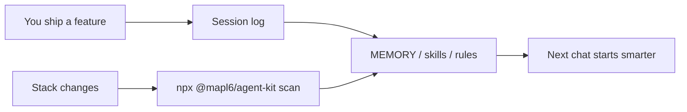

# Agent Kit

**One command to give Cursor, Claude Code, Copilot, Aider, and Cline a real project brain.**

Most `AGENTS.md` files are empty templates. Agent Kit **scans your frontend repo** and fills skills, rules, architecture, and memory from your actual stack.

[](https://www.npmjs.com/package/@mapl6/agent-kit)
[](https://www.npmjs.com/package/@mapl6/agent-kit)
[](./LICENSE)
[](https://github.com/Mapl6/agent-kit)

```bash
npx @mapl6/agent-kit
```

Works with any agent that reads Markdown. Plain files + a CLI — not another runtime.

## Why this exists

AI coding agents are only as good as the repo they land in. Without a kit they guess your stack, invent folder names, and skip tests.

Agent Kit drops in an `AGENTS.md` that already knows your app:

| Detects | Writes |
|---|---|
| Next.js, Vite, Remix, and friends | `AGENTS.md` + Cursor / Claude / Copilot pointers |
| `app/` vs `src/` routing | `agent/docs/architecture.md` + `ui-architecture.md` |
| npm / pnpm / yarn / bun | `agent/commands.md` |
| ESLint, Prettier, Vitest, Playwright | `agent/rules/*` |
| Your real scripts | `agent/memory/MEMORY.md` |

Generated blocks are wrapped in HTML comments. Your own notes stay intact when you re-scan.

## Quick start

```bash
cd your-frontend-app
npx @mapl6/agent-kit
```

Then open root `AGENTS.md`. The agent must read the listed `/agent/` files in order, then follow the matching skill step by step.

Stack changed later?

```bash
npx @mapl6/agent-kit scan
```

## Commands

| Command | What it does |
|---|---|
| `init` (default) | Scaffold the kit, then scan the project |
| `scan` | Re-read the repo and refresh generated sections |
| `enhance` | Add any missing kit files, then scan |
| `add-skill <name>` | Scaffold `agent/skills/<name>/SKILL.md` |
| `doctor` | Health check + scan summary |

```bash
npx @mapl6/agent-kit --yes          # skip prompts
npx @mapl6/agent-kit scan --report  # print detection JSON
npx @mapl6/agent-kit doctor
npx @mapl6/agent-kit add-skill checkout-flow
```

## What you get

```text
AGENTS.md                 ← root operating procedure (read /agent files in order)
CLAUDE.md / .cursorrules  ← vendor pointers back to AGENTS.md
.agent-kit.json           ← version + last scan
agent/
  skills/                 ← playbooks (setup, feature, a11y, debug, deploy…)
  memory/                 ← MEMORY.md, USER.md, session-log.md
  docs/                   ← architecture, UI, data, file roles
  rules/                  ← coding, git, security, testing
  context/                ← conventions, glossary, known issues
  improvement.md          ← promote lessons over time
  handoff.md              ← continue the same work in a new chat
```

## How the loop works



1. Agents read root `AGENTS.md`, then the `/agent/` files it lists, **in order**.
2. After real work, they append `agent/memory/session-log.md`.
3. Durable facts move into `MEMORY.md`, a new skill, or a rule.
4. Re-scan when you add Next, Playwright, a new package manager, and so on.

## Works with

Cursor · Claude Code · GitHub Copilot · Aider · Cline · any Markdown-reading agent

Inspired by Hermes-style agent patterns (skills, memory budgets, learn loop) — ported to **plain Markdown**, not a Hermes runtime.

## FAQ

**Will it overwrite my files?**  
If `AGENTS.md` already exists at the project root, the kit is **appended at the end** (a short pointer is added at the top). Other kit files are skipped if they already exist (`--force` overwrites). Generated `<!-- agent-kit:generated:* -->` blocks can be re-scanned without wiping your prose.

**Frontend only?**  
It is frontend-first (Next, Vite, routing, a11y, UI QA). It still works in other Node repos; detection will just be thinner.

**Do I need an account?**  
No. `npx @mapl6/agent-kit` is enough.

## Star & share

If this saves you a setup hour, [star the repo](https://github.com/Mapl6/agent-kit) so other frontend teams can find it. Issues and PRs are welcome.

```bash
npx @mapl6/agent-kit
```
